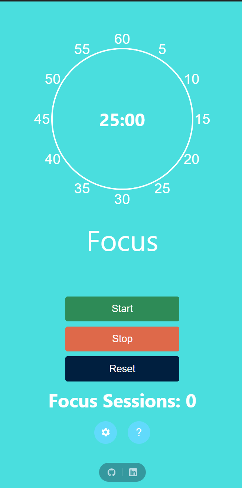
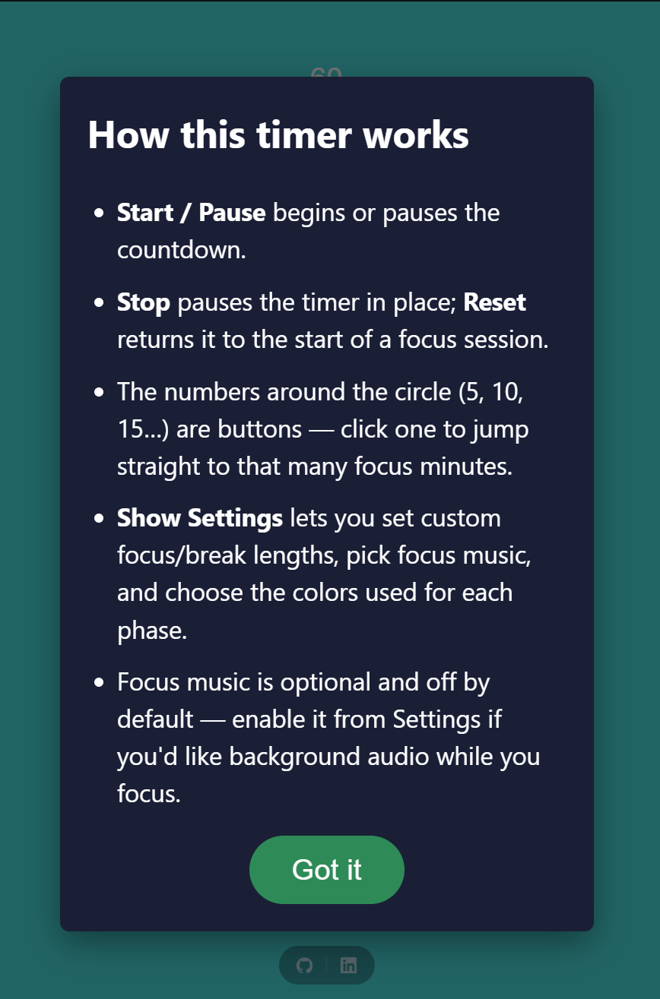
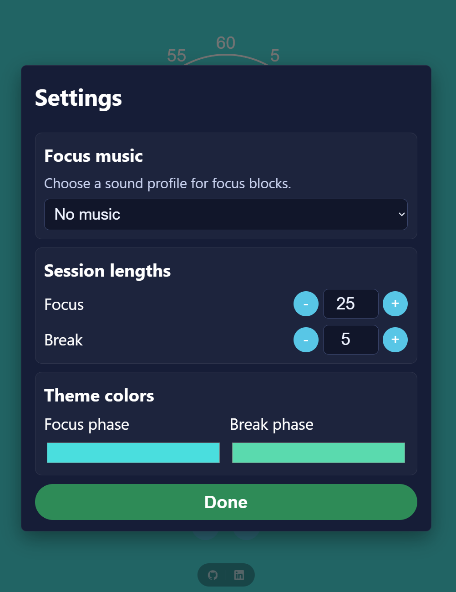
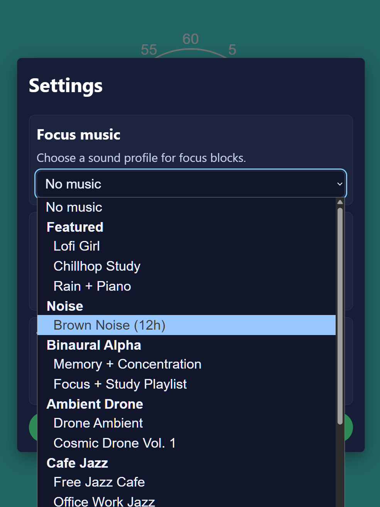

# Pomodoro Focus Timer

A clean Pomodoro-style focus timer built with React, TypeScript, and Vite.

**Live app:** https://focus-music-timer.netlify.app/

## Features

- Focus/Break timer with Start, Pause, Stop, and Reset controls
- Circular minute dial presets (5–60) that update the active focus duration
- Settings modal for:
  - focus and break minute lengths
  - curated SoundCloud focus music categories
  - focus/break phase colors
- Instructions modal for quick onboarding
- Session tracking (`Focus Sessions`) persisted in `localStorage`
- Dynamic tab title and progress favicon during countdown
- Animated background gradient tied to timer progress
- Footer links (GitHub + LinkedIn) with subtle SVG icons
- Google Analytics consent-aware behavior (`gtag` default denied until user opts in)
- SEO/social metadata:
  - Open Graph + Twitter cards
  - JSON-LD (`WebApplication`)
  - `robots.txt` + `sitemap.xml`
  - `og-image.png`

## Screenshots

| Main timer | Settings modal |
|---|---|
|  |  |

| Music options | Instructions modal |
|---|---|
|  |  |

## Tech Stack

- React 18
- TypeScript
- Vite
- ESLint

## Local Development

```bash
npm install
npm run dev
```

## Scripts

- `npm run dev` — start local dev server
- `npm run build` — type-check and build production bundle
- `npm run preview` — preview production build locally
- `npm run lint` — run ESLint

## Project Structure

- `src/App.tsx` — main UI and app wiring
- `src/components/` — modal components
- `src/customHooks/` — timer, settings, music options, session tracking, UI sync hooks
- `src/assets/sounds/` — local alert sound
- `public/` — manifest, service worker, OG image, sitemap, robots, screenshots
